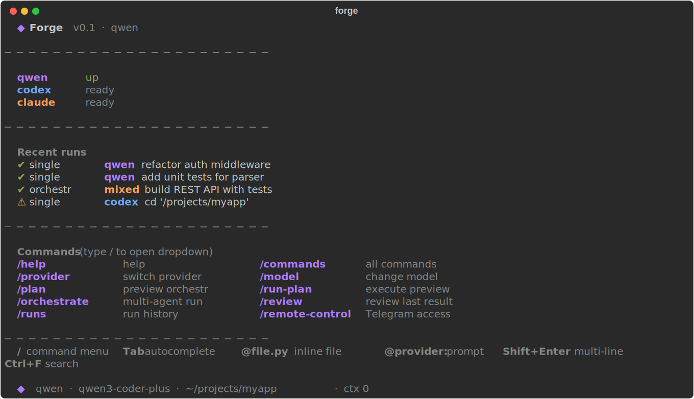
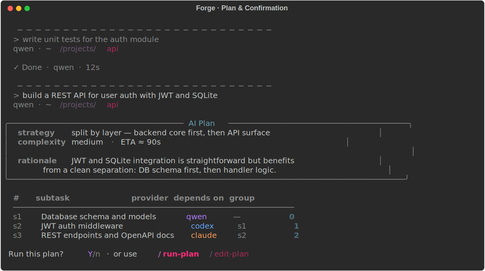
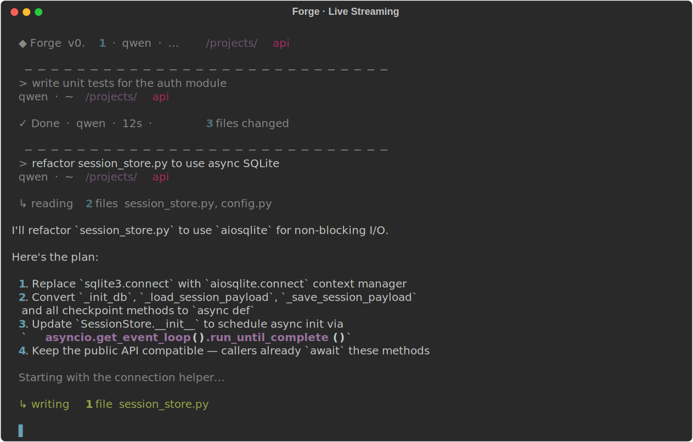
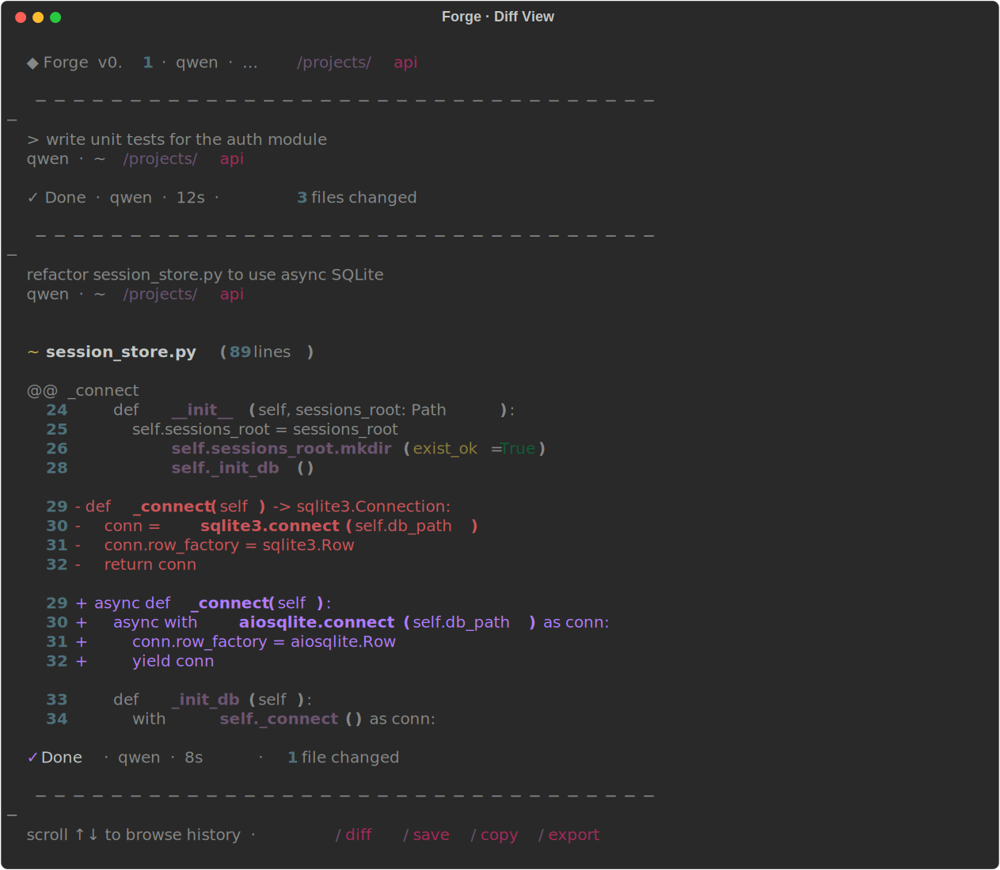

# Forge

TUI-first multi-provider coding CLI for Qwen, Codex, and Claude.

Forge gives you one interface for:

- running coding tasks through multiple CLI agents
- switching providers and models without leaving the session
- previewing and executing ordered multi-agent plans
- retrying failed steps, reviewing results, and recovering interrupted runs
- using Telegram as remote control when you need to step away from the terminal

`forge` launches the Textual TUI by default.

## Screenshots

### Welcome Screen



### Multi-provider Orchestration



### Live Streaming with Operation Indicator



### Diff View with Line Numbers



## Status

`v0.1` release candidate.

This release focuses on a practical, polished coding workflow:

- TUI-first interface
- single-agent runs
- ordered multi-agent orchestration
- checkpoints and recovery
- SQLite-backed session persistence
- metrics and provider health visibility

Forge does **not** yet claim to be a full DAG scheduler or an autonomous agent swarm.

## Features

- TUI-first CLI with command palette style slash workflow
- Lightweight fallback shell via `forge --shell`
- Multi-provider execution: `qwen`, `codex`, `claude`
- Provider and model switching in-session
- Ordered orchestration with plan preview
- Retry failed orchestration steps on another provider
- Synthesis and review passes for multi-step runs
- Run history, artifacts, diff, export, save, copy, clipboard helpers
- Checkpoints and crash recovery
- Telegram remote control
- Provider health, limits, usage, and internal metrics
- SQLite-backed session storage

## Quick Start

### Requirements

- Python 3.11+
- Installed and authenticated provider CLIs you want to use:
  - `qwen`
  - `codex`
  - `claude`

### Install dependencies

```bash
python -m pip install -r requirements.txt
```

For development and coverage:

```bash
python -m pip install -r requirements-dev.txt
```

### Launch Forge

Textual TUI:

```bash
forge
```

Fallback line shell:

```bash
forge --shell
```

One-shot non-interactive commands:

```bash
python bridge_cli.py run "fix the parser"
python bridge_cli.py orchestrate "build a small CLI app"
```

## Core Workflow

### Single-agent run

Open Forge and type a normal prompt:

```text
Refactor the session store and add tests
```

### Switch provider

```text
/provider codex
/model codex o3
```

### Preview an orchestration plan

```text
/plan Build a desktop app with Python parsing, Rust backend, and GTK UI
```

### Run the last previewed plan

```text
/run-plan
```

### Run orchestration directly

```text
/orchestrate Build a desktop app with Python parsing, Rust backend, and GTK UI
```

### Review the last result

```text
/review focus on bugs and missing tests
```

### Recover interrupted orchestration

```text
/recover
/recover confirm
```

## Important Commands

### Session

- `/commands`
- `/clear`
- `/compact [N|filter]`
- `/history [n]`
- `/retry`
- `/expand`

### Workspace

- `/cd <path>`
- `/cwd`
- `/diff`
- `/commit [message]`
- `/save [filename]`
- `/export [md|txt]`

### Providers

- `/provider <name>`
- `/providers`
- `/model`
- `/model <provider> <model>`

### Orchestration

- `/plan <task>`
- `/run-plan`
- `/orchestrate <task>`
- `/replan`
- `/recover`

### Status

- `/status`
- `/limits`
- `/usage`
- `/metrics`
- `/stats`
- `/todos`

### Remote

- `/remote-control`
- `/remote-control status`
- `/remote-control stop`
- `/remote-control logs`

## Telegram Remote Control

Forge can expose the same session remotely through the Telegram bot layer.

Useful commands:

```text
/remote-control
/remote-control status
/remote-control logs
```

## Storage

Session state is stored in SQLite under `.session_data/session_store.sqlite3`.

Artifacts and exported run markdown files are still written to the filesystem under `.session_data/`.

## Metrics and Health

Forge exposes:

- in-app `/metrics`
- provider health and limit summaries
- optional local HTTP endpoints:
  - `/health`
  - `/metrics`

Environment variables:

```bash
ENABLE_STATUS_HTTP=1
STATUS_HTTP_HOST=127.0.0.1
STATUS_HTTP_PORT=8089
```

## Configuration

Common environment variables:

```bash
QWEN_CLI_PATH=qwen
CODEX_CLI_PATH=codex
CLAUDE_CLI_PATH=claude

RATE_LIMIT_MAX_REQUESTS=20
RATE_LIMIT_WINDOW_SECONDS=3600
MAX_PROMPT_LENGTH=12000
```

Telegram-related variables:

```bash
TELEGRAM_TOKEN=...
ALLOWED_USER_IDS=12345,67890
```

## Testing

Run the full test suite:

```bash
python -m unittest discover -s tests -p 'test_*.py' -q
```

Syntax check:

```bash
python -m py_compile bot.py cli/app.py runtime/orchestrator_service.py
```

## CI

GitHub Actions runs:

- unit tests
- coverage report generation
- syntax verification

Workflow file:

- [`.github/workflows/ci.yml`](/mnt/ae6f86e5-e0fd-4c0b-a314-c1c7c23881ec/projects/qwen-telegram-bridge/.github/workflows/ci.yml)

## Current Limitations

- Orchestration is **ordered-v1**, not a full dependency graph scheduler
- `depends_on` is validated, but execution is still positioned as ordered orchestration
- Dynamic replanning exists, but should be treated as a practical fallback, not guaranteed planning intelligence
- Quality still depends on the installed provider CLIs and their authentication state

## Roadmap

Post-`v0.1` priorities:

- stronger dependency-aware orchestration
- better dynamic replanning
- richer permission UX
- cost tracking
- benchmark mode
- improved provider routing heuristics

## License

MIT
