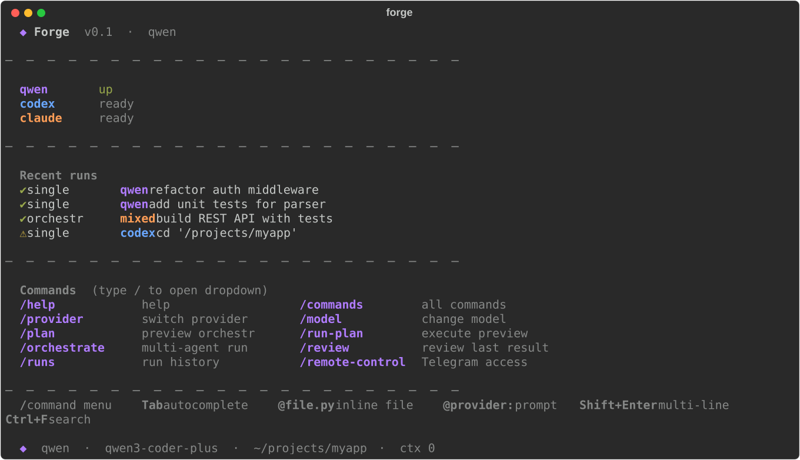
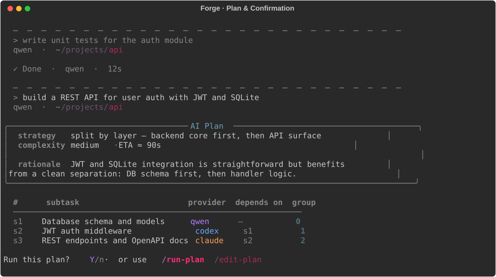
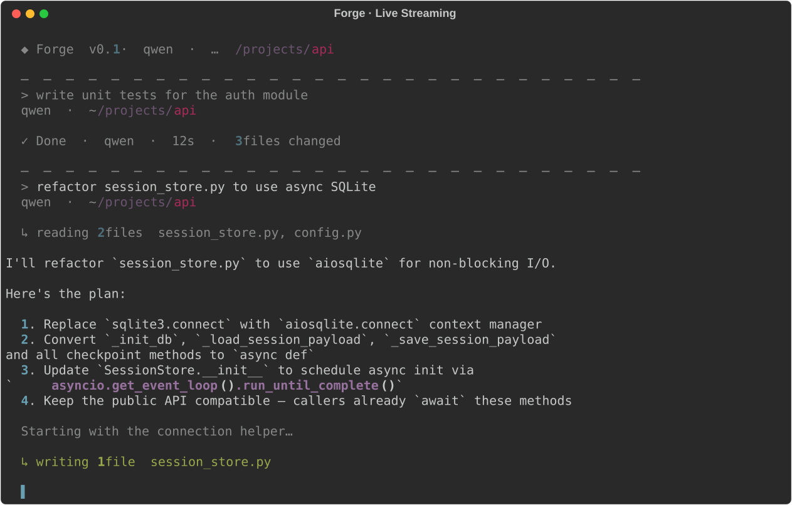
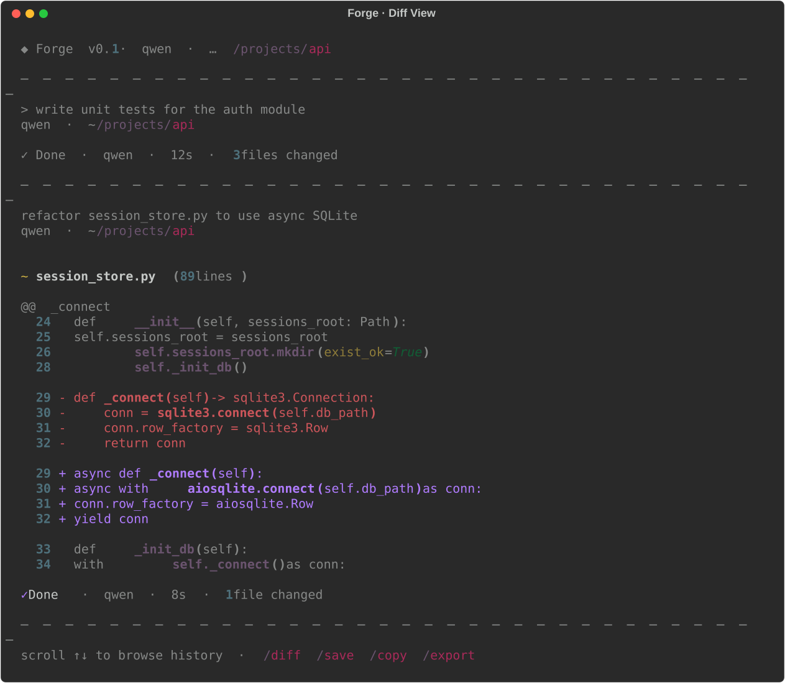

# Forge

TUI-first multi-provider coding CLI — Qwen · Claude · Codex · OpenRouter · local LLMs in one terminal.

Forge gives you one interface for:

- Running coding tasks through multiple AI provider CLIs
- Switching providers and models without leaving the session
- Planning and running ordered multi-agent tasks with AI-driven orchestration
- Asking questions to models mid-task with interactive prompts
- Using Telegram as remote control when away from the terminal

## Screenshots

### Welcome Screen — providers, recent runs, always-visible info bar



### Multi-agent Orchestration — per-agent colours, step headers, animated status bar



### Live Streaming — real-time output, operation indicators, spinner with model name



### Plan Preview — AI-built plan with parallel groups, Y/n confirmation



---

## Quick Start

### Requirements

- Python 3.11+
- At least one installed provider CLI or API key:
  - [`qwen`](https://github.com/QwenLM/qwen-agent) — Qwen coding agent
  - [`codex`](https://github.com/openai/codex) — OpenAI Codex CLI
  - [`claude`](https://github.com/anthropics/claude-code) — Claude Code CLI
  - OpenRouter API key — for 200+ models via HTTP (no CLI required)
  - Antigravity via its `agy` CLI (Gemini models, plus Claude and GPT-OSS ones it fronts)
  - Local OpenAI-compatible server — Ollama, LM Studio, vLLM, llama.cpp server, etc.

### Install

On Arch/CachyOS or any distro with externally managed Python, do not use
`pip install --user -e .`. Use a virtual environment:

```bash
git clone https://github.com/maksimkaosipov75-design/Forge.git
cd Forge
python -m venv --system-site-packages .venv
. .venv/bin/activate
python -m pip install -e .
```

For development tools (pytest, coverage):

```bash
pip install -r requirements-dev.txt
```

### Launch

**Native GTK4 desktop preview:**

```bash
./forge-desktop
```

The repository-local launcher does not require installing the package. You can also run the module directly:

```bash
python -m desktop.gtk.app
```

To install Forge as a local Linux desktop app with a launcher, icon, and app
menu entry:

```bash
./scripts/install_desktop.sh
forge-desktop
```

The installer creates an isolated venv under `~/.local/share/forge-ai`, writes
the command to `~/.local/bin/forge-desktop`, and installs XDG desktop metadata
under `~/.local/share`. It uses `--system-site-packages` so GTK4/libadwaita and
PyGObject can come from your distro packages.

The desktop shell is the new GTK4/libadwaita frontend for Forge. It reuses the same provider runtime as the CLI and is being built toward a Claude Desktop/Cowork-style workspace with sessions, planning, task progress, diffs, files, and previews.

Current desktop preview capabilities:

- Provider switching and model override controls
- Searchable OpenRouter model picker with catalog refresh
- OpenRouter API key setup through the existing credential store
- Single-agent prompt runs with live stream events
- Plan preview and `Run Plan` orchestration
- Live task rows for orchestrated subtasks
- Touched-file and git numstat summary after runs
- Artifact pane with saved run markdown preview
- `Open Artifact` action for reloading the latest run artifact
- Button-controlled sidebar and workspace inspector panels for resizable layouts

**Textual TUI** (default):

```bash
forge
```

**Lightweight line shell:**

```bash
forge --shell
```

**Non-interactive one-shot commands:**

```bash
forge run "fix the parser"
forge orchestrate "build a small CLI app"
```

On Linux, `forge-desktop` requires GTK4, libadwaita, and PyGObject from your system packages. The existing `forge` TUI remains the default terminal interface.

---

## Providers

| Provider   | Type      | Setup                              |
|------------|-----------|------------------------------------|
| `qwen`     | CLI       | Install `qwen` CLI, run `qwen auth` |
| `codex`    | CLI       | Install `codex` CLI, run `codex auth` |
| `claude`   | CLI       | Install `claude` CLI, run `claude auth` |
| `openrouter` | API key | `/auth openrouter` inside Forge    |
| `local`    | Local API | Run an OpenAI-compatible server; default: `http://127.0.0.1:11434/v1` |

### Switching providers

```
/provider claude
/provider openrouter
/provider local
```

### Switching models

```
/model                        # show current model
/model codex o3               # set model for a provider
/model openrouter             # interactive model picker
/model local qwen2.5-coder:7b # local model served by Ollama/LM Studio/etc.
/model local tools          # choose a local model known to support tools
/model local tools qwen     # pick a tool-capable local coding model
/model local refresh          # refresh installed local models
/model local pull devstral    # download with Ollama and select it
/model local Qwen GGUF        # search local presets + Hugging Face candidates
```

Local models use OpenAI-compatible chat completions in chat-only mode by default,
which matches LM Studio/Ollama chat behavior and avoids confusing smaller models
with tool schemas. To run local agentic coding with file/shell tools, set
`LOCAL_LLM_ENABLE_TOOLS=1` and choose a model marked as tool-capable. The
interactive model picker also works for `local`: open it with `/model local`,
search by name, alias, or Hugging Face repo, and press Enter. Installed models
are selected immediately; not-installed models are downloaded through Ollama and
selected. Local rows are labeled as `tools`, `chat-only`, or `tools?`; use
`/model local tools` for a separate picker that only shows models marked as
tool-capable for agentic coding. `D` in the Textual picker and `Download
selected` in the desktop dialog do the same explicitly. Hugging Face results are
installed as `hf.co/<repo-id>` model names. Configure with:

```bash
LOCAL_LLM_BASE_URL=http://127.0.0.1:11434/v1
LOCAL_LLM_DEFAULT_MODEL=qwen2.5-coder:7b
LOCAL_LLM_STARTUP_TIMEOUT=600   # cold GPU/model load grace period
LOCAL_LLM_API_KEY=              # optional, for servers that require auth
LOCAL_LLM_ENABLE_TOOLS=0        # set 1 only for tool-capable local agent models
LOCAL_LLM_DISABLE_THINKING=1    # adds /no_think for local Qwen3 models by default
```

---

## Helper agents

The agent working on your task can hand a self-contained piece of it to a cheaper
model rather than doing it itself. It decides when; you do not manage it.

The point is context, not just price. Reading a dozen files to find where
something is handled costs the expensive model most of its window; a local model
can do the same reading and answer in three lines. What comes back is the answer,
not the material it was derived from — so the model holding your task keeps its
context for the part that needs judgement.

Three roles, differing only in which model runs them, which tools they may call,
and what they are told they are for:

| Role | For | Tools |
|---|---|---|
| `search` | locating things in the codebase | read-only |
| `review` | checking work already done | read-only |
| `implement` | carrying out one decided change | read, write, bash |

`review` is read-only on purpose. A reviewer that can also fix what it found
destroys the signal — you can no longer tell whether the work was right or the
reviewer quietly rescued it. It reports a verdict and the specifics; the agent
that asked decides what to do about it.

Helpers cannot delegate in turn. They are built without a delegate callback, so
the tool is never offered to them: the depth limit is a property of how they are
constructed rather than a counter someone has to remember to check.

Configure with `DELEGATE_SEARCH`, `DELEGATE_REVIEW` and `DELEGATE_IMPLEMENT`,
each `provider[:model]`:

```bash
DELEGATE_SEARCH=local:qwen2.5-coder:7b
DELEGATE_REVIEW=local:qwen2.5-coder:14b
DELEGATE_IMPLEMENT=openrouter:qwen/qwen3-coder:free
```

Only the first colon separates provider from model, so Ollama tags survive
intact. Set `DELEGATION_ENABLED=0` to turn it off; the agent then does
everything itself.

**CLI providers can be helpers, with one limit.** `qwen`, `codex`, `claude` and
`antigravity` are agents in their own right: Forge can hand them a prompt but cannot take
their tools away. `implement` is fine there — it is defined by what it is asked
to do. `search` and `review` are not, because they are defined by what they may
*not* touch, and a reviewer that can edit is not a reviewer. Pointing those two
at a CLI provider is refused with an explanation rather than run without the
guarantee.

Run `/helpers` to see what each role resolves to right now, and whether the
project's checks have been approved. It answers without spending anything, which
is useful before there is a local model or any API credit to spend.

## Core Workflow

### Single-agent run

Type a prompt directly:

```
Refactor the session store and add tests
```

### Orchestration (multi-agent plan)

Preview a plan before running:

```
/plan Build a desktop app with Python parsing, Rust backend, and GTK UI
/run-plan
```

Run directly:

```
/orchestrate Build a small REST API with auth and tests
```

Recover a partially-completed orchestration:

```
/recover
/recover confirm
```

### Interactive model questions

When a model needs a decision mid-task, Forge pauses and shows a styled prompt.
Answer inline — the response is fed back to the model automatically.

---

## Commands Reference

### Session

| Command | Description |
|---------|-------------|
| `/commands` | Show all available commands |
| `/clear` | Clear conversation history |
| `/compact [N\|filter]` | Summarise old history |
| `/history [n]` | Show recent runs |
| `/retry` | Retry last prompt |
| `/expand` | Show full last response |

### Workspace

| Command | Description |
|---------|-------------|
| `/cd <path>` | Change working directory |
| `/cwd` | Show current directory |
| `/diff` | Show files changed since last run |
| `/commit [message]` | Commit changed files via git |
| `/save [filename]` | Save last response to file |
| `/export [md\|txt]` | Export session to file |

### Providers & Models

| Command | Description |
|---------|-------------|
| `/provider <name>` | Switch active provider |
| `/providers` | List available providers and status |
| `/model` | Show current model |
| `/model <provider> <model>` | Set model |
| `/auth <provider>` | Authenticate a provider |

### Orchestration

| Command | Description |
|---------|-------------|
| `/plan <task>` | Build and preview a multi-agent plan |
| `/run-plan` | Execute the last previewed plan |
| `/orchestrate <task>` | Plan and run immediately |
| `/replan` | Rebuild the plan for the last task |
| `/recover` | Resume an interrupted orchestration |

### Status & Metrics

| Command | Description |
|---------|-------------|
| `/status` | Provider health overview |
| `/limits` | Rate limit status |
| `/usage` | Token usage for this session |
| `/metrics` | Aggregated metrics across all runs |
| `/stats` | Per-provider statistics |
| `/todos` | Extract TODOs from last response |

### Remote Control

| Command | Description |
|---------|-------------|
| `/remote-control` | Start Telegram remote control |
| `/remote-control status` | Show remote control state |
| `/remote-control stop` | Stop remote control |
| `/remote-control logs` | Tail remote control logs |

---

## Configuration

Create a `.env` file in the project root (or copy `.env.example`):

```bash
# Provider CLI paths (if not on $PATH)
QWEN_CLI_PATH=qwen
CODEX_CLI_PATH=codex
CLAUDE_CLI_PATH=claude

# OpenRouter API (for /auth openrouter or direct key)
OPENROUTER_API_KEY=

# Local OpenAI-compatible LLM server
LOCAL_LLM_BASE_URL=http://127.0.0.1:11434/v1
LOCAL_LLM_DEFAULT_MODEL=qwen2.5-coder:7b
LOCAL_LLM_API_KEY=
LOCAL_LLM_STARTUP_TIMEOUT=600
LOCAL_LLM_ENABLE_TOOLS=0
LOCAL_LLM_DISABLE_THINKING=1

# Rate limiting
RATE_LIMIT_MAX_REQUESTS=20
RATE_LIMIT_WINDOW_SECONDS=3600
MAX_PROMPT_LENGTH=12000

# Telegram remote control (optional)
TELEGRAM_TOKEN=
ALLOWED_USER_IDS=12345,67890

# Optional local health/metrics HTTP server
ENABLE_STATUS_HTTP=0
STATUS_HTTP_HOST=127.0.0.1
STATUS_HTTP_PORT=8089
```

---

## Telegram Remote Control

Forge can expose the current session through a Telegram bot.

Start from inside the CLI:

```
/remote-control
```

Or run the bot as a standalone process:

```bash
python main.py
```

Requires `TELEGRAM_TOKEN` and `ALLOWED_USER_IDS` in `.env`.

Bot commands: `/start`, `/help`, `/status`, `/provider`, `/model`, `/cancel`, `/history`, `/runs`, `/metrics`, `/limits`, `/usage`, `/todos`, `/clear`, `/compact`.

---

## Project Structure

```
forge/
├── bot/                    # Telegram remote control bot
│   ├── handlers/           # Command, callback, file, history, task handlers
│   ├── core.py             # BotCore — dispatcher wiring and main state
│   ├── streaming.py        # Live streaming to Telegram messages
│   ├── formatting.py       # HTML/Markdown formatting for Telegram
│   ├── file_registry.py    # Short-ID registry for Telegram callback data
│   └── ui.py               # Telegram UI helpers (chunks, buttons, previews)
│
├── cli/                    # Terminal user interface
│   ├── commands/           # Individual slash-command implementations
│   ├── app.py              # TUI entry point (Textual app)
│   ├── shell.py            # Lightweight line shell (BridgeShell)
│   ├── ui.py               # Rich-based output, status bar, interactive prompts
│   ├── prompt.py           # Low-level prompt primitives (masked, confirm, text)
│   ├── textual_app.py      # Textual widgets and screens
│   ├── session_actions.py  # Session-level actions (clear, compact, export)
│   └── command_catalog.py  # Command registry and help text
│
├── core/                   # Shared domain logic
│   ├── config.py           # Settings (pydantic-settings + .env)
│   ├── providers.py        # Provider definitions and routing
│   ├── openrouter_catalog.py  # OpenRouter model discovery and caching
│   ├── parser.py           # Stream parser — FORGE_EVENT decoding, categories
│   ├── event_protocol.py   # FORGE_EVENT encode/decode protocol
│   ├── orchestrator.py     # AI and rule-based orchestration planner
│   ├── task_models.py      # Data models (ChatSession, TaskRun, TaskResult, …)
│   ├── session_store.py    # SQLite-backed session persistence
│   ├── process_manager.py  # Provider subprocess lifecycle management
│   ├── file_manager.py     # Working directory and project file tracking
│   ├── provider_status.py  # Provider health checking
│   ├── provider_status_http.py  # Optional HTTP health/metrics server
│   ├── credential_store.py # Encrypted API key storage
│   ├── metrics.py          # Aggregated run metrics
│   ├── rate_limiter.py     # Per-user rate limiting
│   └── security_audit.py   # Prompt safety validation
│
├── runtime/                # Execution engine
│   ├── container.py        # RuntimeContainer — dependency wiring
│   ├── executor.py         # ExecutionService — task execution, file tracking
│   ├── api_backends.py     # HTTP API backends (OpenRouter, local LLM)
│   └── orchestrator_service.py  # OrchestratorService — multi-agent runs
│
├── tests/                  # Test suite (unittest)
├── docs/                   # Documentation and screenshots
├── scripts/                # Utility scripts
│   ├── build.sh            # Build helper
│   └── install_videograb.sh  # yt-dlp installer
│
├── main.py                 # Telegram bot entrypoint
├── main_codex.py           # Legacy standalone Codex bot
├── bridge_cli.py           # CLI entrypoint shim
├── bot.py                  # Compatibility shim → bot/
└── pyproject.toml
```

---

## Testing

```bash
# Run all tests
python -m pytest tests/ -q

# With coverage
python -m coverage run -m pytest tests/ -q
python -m coverage report

# Syntax check only
python -m compileall -q .
```

---

## What's New in 0.2.0

- **bot/ package** — monolithic `bot.py` split into focused modules under `bot/`
- **OpenRouter real-time streaming** — events arrive mid-response; thinking blocks render as they stream
- **Claude thinking blocks via OpenRouter** — extended delta format parsed and rendered
- **CLI interactive prompts** — styled Rich panels for secrets, confirmations, and model questions
- **Model interaction callback** — models can ask questions mid-task; answers fed back automatically
- **AI-driven planning** — `build_plan()` tries AI orchestrator first, falls back to rule-based
- **Smarter file tracking** — skips `venv/`, `node_modules/`, `__pycache__/` and other noise dirs
- **core/ package** — all shared modules consolidated out of root

---

## License

MIT
